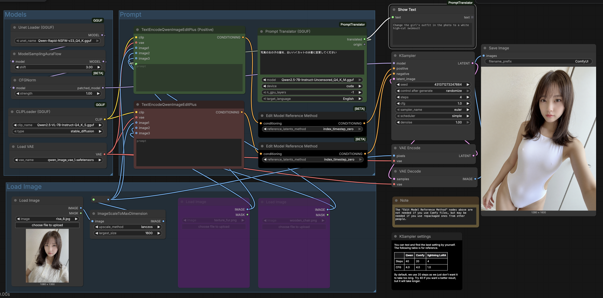

# ComfyUI-PromptTranslator

English | [中文](README.md)

A ComfyUI custom node for translating text prompts using local GGUF models. Powered by llama-cpp-python, it supports translation to English or Chinese without requiring internet connection or API keys.

## Features

- **Local Translation**: Uses GGUF models via llama-cpp-python, no internet required
- **Auto Language Detection**: Automatically detects input language using langdetect
- **English & Chinese Support**: Translate to English or Chinese (Simplified)
- **Model Caching**: Loaded models are cached to avoid repeated loading

## 1. Installation

### Prerequisites

- Python 3.10+
- ComfyUI installed

### Install the Node

```bash
cd ComfyUI/custom_nodes
git clone https://github.com/yourusername/ComfyUI-PromptTranslator.git
cd ComfyUI-PromptTranslator
pip install -r requirements.txt
```
Restart ComfyUI


## 2. Model Directory

### Where to place GGUF models

Place your `.gguf` model files in models/gguf:

```
ComfyUI/
├── models/
│   └── gguf/           
│       ├── Qwen2.5-7B-Instruct-Q4_K_M.gguf
│       ├── Qwen2.5-7B-Instruct-Uncensored.Q4_K_M.gguf
│       └── ...
```

The node will automatically:
1. Scan and list all `.gguf` files in  `models/gguf/` directory.
2. Create the `models/gguf/` directory if it doesn't exist

### Recommended Models

| Model | Size | Download |
|-------|------|----------|
| Qwen2.5-7B-Instruct-Q4_K_M.gguf | ~4.7GB | [HuggingFace](https://huggingface.co/Qwen/Qwen2.5-7B-Instruct-GGUF) |
| Qwen2.5-7B-Instruct-Uncensored.Q4_K_M.gguf | ~4.7GB | [HuggingFace](https://huggingface.co/QuantFactory/Qwen2.5-7B-Instruct-Uncensored-GGUF/resolve/main/Qwen2.5-7B-Instruct-Uncensored.Q4_K_M.gguf) |

**Note**: Larger models provide better translation quality but require more VRAM/RAM.


## 3. Usage Guide

### Screenshot



## License

MIT License

